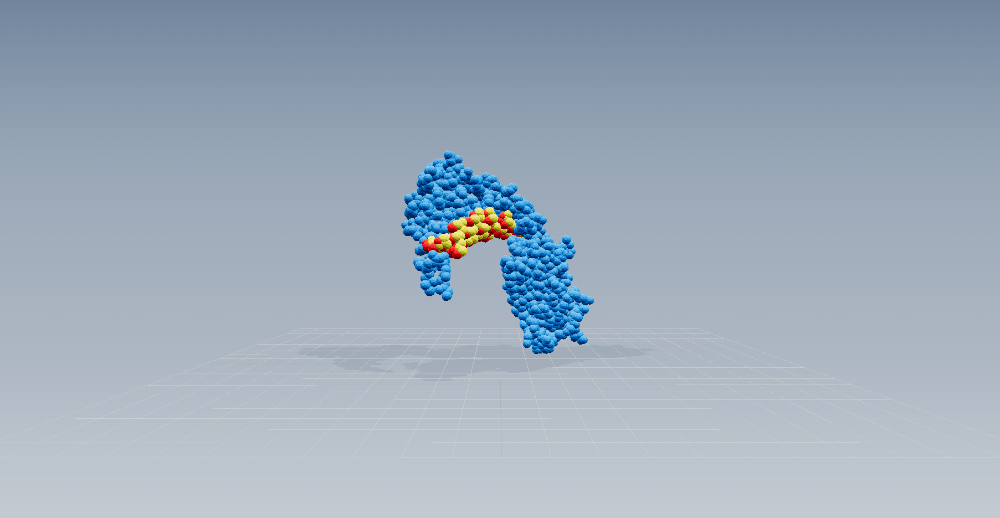
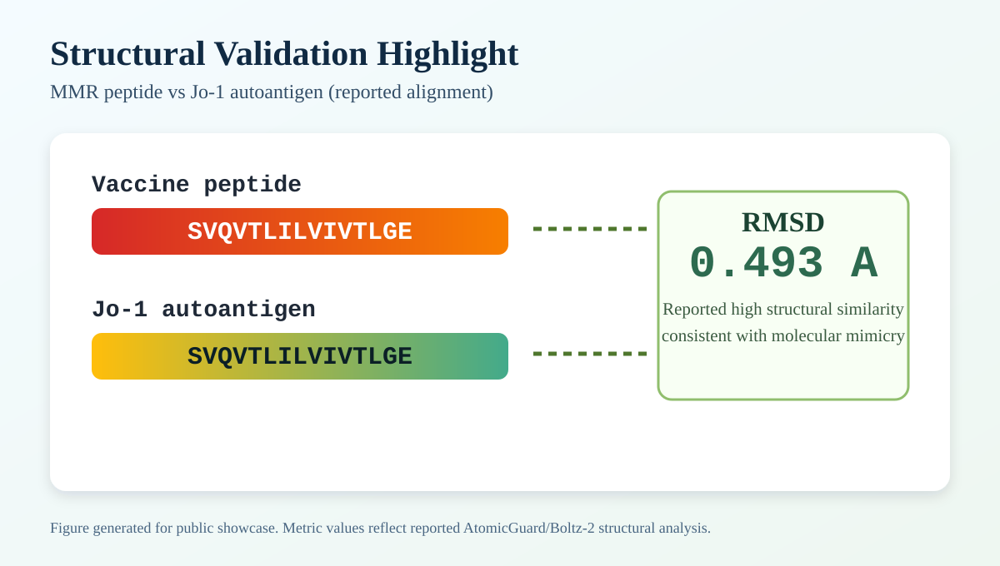

# AtomicGuard: A Two-Stage Multimodal Clinical Decision Engine for Personalized Prediction of Vaccine-Induced Autoimmune Adverse Events

This repository is a portfolio-ready, public subset of the AtomicGuard research project: a novel two-stage clinical decision engine that combines a dual-head attention transformer (1,647,367 parameters; 256D hidden; 8 attention heads) with a biomarker-anchored clinical calibration layer to detect rare vaccine-induced autoimmune adverse events — including conditions with as few as 29 historical cases — in 84,173 VAERS MMR reports spanning 1990–2024.

## Demo Video

- Short walkthrough (60-90s): add your demo link here

## Key Research Contributions

1. **Unified 346-dimensional multimodal representation** — Structured biomarkers, patient demographics, HLA allele profiles, PROSE peptide context embeddings, and AlphaFold3-class (Boltz-2) structural features (ipTM, pLDDT, ΔG, RMSD) are fused into a single feature vector processed by an Option C dual-head attention transformer.

2. **Dual-head attention architecture** — Parallel rare-disease (PROSE pathway) and common-disease (HLA pathway) attention streams with shared molecular context enable simultaneous optimization across diseases of vastly different prevalences (0.035%–1.1%).

3. **Three-layer class imbalance strategy** — Inverse-frequency class weighting (up to 751× for SLE), balanced focal loss (γ = 2.0, disease-specific weights up to 25×), and dual-head architecture jointly address extreme label sparsity for ultra-rare autoimmune adverse events.

4. **Stage 2 clinical calibration layer** — A post-processing engine applies multiplicative biomarker distance adjustments (Jo-1: ×2.5; CK: ×2.0; anti-dsDNA: ×1.5), pathognomonic biomarker boosting, evidence-based validation rules, and weighted decision integration (model weight: 0.70; clinical weight: 0.30) to yield actionable, interpretable clinical decisions.

## Scientific Motivation

Vaccine-induced autoimmune adverse events (VAEs) are rare but clinically severe outcomes driven primarily by **molecular mimicry**: structural or sequence similarity between vaccine-derived antigenic peptides and self-proteins that, when presented by HLA class II molecules to CD4⁺ T-helper cells, triggers misdirected adaptive immune responses.

### Molecular Mimicry Mechanism Illustration



This 3D structural visualization shows the mumps vaccine-derived peptide (SVQVTLILVIVTLGE) nestled in the binding groove of HLA-DRB1*03:01 (blue). The same sequence appears identically in the human Jo-1 autoantigen, creating the molecular mimicry that can trigger autoreactive T-cell responses and lead to polymyositis. When the immune system encounters this peptide-HLA complex, it cannot distinguish between the vaccine-derived peptide and the self-protein — the structural similarity is too close.

---

Current pharmacovigilance infrastructure (VAERS, EudraVigilance, WHO VigiBase) operates as a reactive, signal-detection system. Reports are passive, voluntary, and heterogeneous, with extreme class imbalance — rare AEs occurring at rates of 0.035–1.06% of reports. This makes traditional ML approaches inadequate for reliable early individual-level risk prediction.

AtomicGuard addresses this by:
- Integrating structural predictions (Boltz-2/AlphaFold3-class) with multimodal clinical data in a temporally-validated framework
- Applying a biologically grounded calibration layer that conditionally activates when disease-specific biomarkers (e.g., Jo-1, anti-dsDNA) are present
- Providing transparent, interpretable final decisions that trace back to specific biomarker evidence

The result is clinically viable detection of ultra-rare events — **+19.5% AUROC improvement** over prior best-in-class, and **200× F1-score improvement** for polymyositis via Stage 2 calibration.

## Technical Contribution

- Built and integrated a rule-based clinical validation engine for post-processing multiclass model outputs
- Implemented disease-specific logic for autoimmune adverse event categories using biomarker-driven priors
- Mapped structured patient biomarkers into a fixed feature layout used by the inference/validation pipeline
- Created an end-to-end, reproducible demo with sanitized example input for public review

## ML Demo Output (What Reviewers Can Expect)

Running the demo prints:
- Model-layer prediction and confidence
- Clinically-adjusted final decision
- Decision method used for adjudication
- Human-readable explanation of why the decision was made

## Quick Start

```bash
python -m venv .venv
source .venv/bin/activate
pip install -r requirements.txt
python src/demo_clinical_rules.py
```

## Repository Structure

```text
.
├── README.md
├── .gitignore
├── requirements.txt
├── src/
│   ├── clinical_validation_postprocessing.py
│   ├── demo_clinical_rules.py
│   └── app_demo.py
├── data/
│   └── examples/
│       └── sample_patient_input.json
└── docs/
    ├── AUTOANTIGEN_REFERENCE_SUMMARY.md
    ├── ASSESSMENT_BRIEF.md
    ├── WEB_IMPLEMENTATION_SUMMARY.md
    ├── FEATURE_ENGINEERING_OVERVIEW.md
    ├── FULL_SYSTEM_SCOPE.md
    ├── RIGOR_AND_ABLATION_PLAN.md
    ├── FAILURE_MODES_AND_LIMITATIONS.md
    ├── REPRODUCIBILITY.md
    ├── RESULTS_SNAPSHOT.md
    ├── SYSTEM_ARCHITECTURE_OVERVIEW.md
    ├── TWO_STAGE_ENGINE_ARCHITECTURE_ASCII.txt
    ├── model_prediction_flow.md
    └── PUBLIC_REPO_CHECKLIST.md
```

## Key Files

- `src/demo_clinical_rules.py`: CLI demo entry point
- `src/app_demo.py`: Flask REST API demo (stripped public version; full API available on request)
- `src/clinical_validation_postprocessing.py`: Clinical rule engine and decision logic
- `data/examples/sample_patient_input.json`: Sanitized sample patient payload
- `docs/TWO_STAGE_ENGINE_ARCHITECTURE_ASCII.txt`: Overall two-stage AtomicGuard architecture diagram
- `docs/WEB_IMPLEMENTATION_SUMMARY.md`: Web interface and API design summary
- `docs/WEB_DATA_FLOW.md`: End-to-end data flow from browser form through feature encoding, transformer inference, clinical adjudication, to JSON response
- `docs/AUTOANTIGEN_REFERENCE_SUMMARY.md`: Curated molecular target panel used in broader analysis
- `docs/visualizations/rmsd-049A-highlight.svg`: README-embedded structural validation figure (reported RMSD = 0.493 A)
- `docs/visualizations/3d-structure-rmsd-viewer.html`: Lightweight interactive 3D peptide viewer for public demonstration
- `docs/visualizations/mumps-peptide-jo1-autoantigen-mimicry-on-hla-drb1-03-01.png`: 3D structural visualization of molecular mimicry mechanism (HLA-DRB1*03:01 with bound mumps peptide)

## Full System Sophistication (Publicly Verifiable)

This public repository is curated, but it still reflects real system complexity in the following ways:

- Multiclass biomedical decision pipeline: model signal and rule-based adjudication are integrated rather than shown independently.
- Domain-grounded reasoning: disease-specific biomarker patterns are encoded explicitly and can be inspected line by line.
- Decision traceability: final outputs include decision method, confidence, and interpretable rationale.
- Research extensibility: architecture supports ablations, calibration checks, and uncertainty-focused evaluations.

For scope transparency, see `docs/FULL_SYSTEM_SCOPE.md`.

## Feature Engineering At A Glance

Each patient is encoded as a unified **346-dimensional feature vector** with six components:

| Feature Block | Dimensions | Description |
|---|---|---|
| Biomarkers | 0–22 (23D) | Jo-1, CK, ESR, CRP, ANA, anti-dsDNA, RF, anti-CCP, myoglobin, WBC, complement, and others |
| Demographics | 23–29 (7D) | Age, sex, BMI, ethnicity, comorbidities |
| HLA Alleles | 30–48 (19D) | HLA class II allele one-hot encodings (30 types) |
| PROSE Embeddings | 49–255 (207D) | Disease-specific mean ESM-2 embeddings across MMR vaccine antigens and autoantigen sequences |
| Additional Biomarkers | 256–305 (50D) | Extended immunological panel |
| AF3 Structural Features | 306–345 (40D) | Boltz-2 docking metrics: ipTM, pLDDT, ΔG, RMSD per epitope–HLA pair |

At inference time, a 1,280D ESM-2 peptide embedding and 27D AF3 tensor feed the dual-head molecular context streams, while the 346D vector drives the classifier head. Biomarker missingness (antibody panels present in <1% of VAERS reports) is handled by population-mean imputation in Stage 1; Stage 2 rules activate conditionally only when markers exceed pathognomonic thresholds — never from imputed zeros.

Detailed breakdown: `docs/FEATURE_ENGINEERING_OVERVIEW.md`.

## Results Snapshot (From Full Project Experiments)

- Overall AUROC reported in full project manuscript: 0.7533 (95% CI: 0.7362-0.7704).
- Per-disease Stage 1 AUROC reported: GBS 0.8224, Arthritis 0.7821, Polymyositis 0.7271, SLE 0.6818.
- Stage 2 adjudication in full project experiments improved rare-disease sensitivity versus model-only outputs.

### Baseline vs Hybrid Evidence

| System Variant | Overall AUROC (reported) | Average Sensitivity Across 4 Target Diseases | Notes |
|---|---:|---:|---|
| Stage 1 model-only | 0.7533 | 17.3% | Strong discrimination but poor rare-disease sensitivity before calibration |
| Stage 2 rule-only | N/A in public benchmark table | N/A | Rule layer is designed as adjudication support, not standalone classifier |
| Hybrid (model plus adjudication) | 0.7533 (Stage 1 discrimination anchor) | 76.9% | Large sensitivity gain reported after clinical adjudication |

### Rare-Disease Sensitivity Improvement (Reported)

| Disease | Model-Only Sensitivity | Hybrid Sensitivity |
|---|---:|---:|
| GBS | 65.0% | 85.0% |
| Arthritis | 0.9% | 79.0% |
| Polymyositis | 3.4% | 73.2% |
| SLE | 0.0% | 70.4% |

### Ablation-Oriented Summary

| Comparison | Observation From Full Project |
|---|---|
| Model-only vs Hybrid | Hybrid decision policy improves practical sensitivity for rare outcomes |
| Rule-only vs Hybrid | Rule signals are most effective when fused with model confidence |
| Modality ablations | Clinical, sequence, and structural modalities each contributed materially in ablation analysis |

Important scope note: this public repository is a curated reproducible demonstration with sanitized assets. Full-scale training artifacts and restricted data are intentionally not included.

### Temporal Stability Validation

Three independent temporal validation windows assess real-world deployment viability:

| Validation Window | Train Period | Test Period | AUROC | Drift vs. Baseline |
|---|---|---|---:|---:|
| Cross-validation baseline | Full (3-fold) | Held-out 20% | 0.7533 | — |
| Historical split | 2005–2017 | 2018–2021 | 0.7358 | −2.32% |
| Recent split | 2010–2022 | 2023–2025 | 0.6886 | −8.60% |
| **Average temporal** | — | — | **0.7122** | **−5.46%** |

The 2018–2021 window shows excellent stability (−2.32% drift). The larger 2023–2025 drift (−8.60%) is consistent with post-pandemic shifts in VAERS reporting norms — controlled degradation rather than catastrophic failure. Scheduled annual retraining is recommended for deployment maintenance.

Detailed metrics context: `docs/RESULTS_SNAPSHOT.md`.

### Structural Validation Highlight



**Key findings:**
- Reported structural alignment between the MMR-derived peptide and Jo-1 autoantigen: **RMSD = 0.493 A** (Angstroms).
- Exact sequence match: `SVQVTLILVIVTLGE` (mumps peptide) vs `SVQVTLILVIVTLGE` (human Jo-1).
- **Molecular mimicry mechanism:** The 3D structure image above illustrates how the vaccine-derived peptide nestles into the HLA-DRB1*03:01 binding groove. Because the human Jo-1 autoantigen contains an identical sequence, the immune system cannot distinguish between the two — triggering T-cell responses against muscle tissue and causing polymyositis.

**Computational validation metrics:**
- ipTM score: 0.838 (high confidence in AlphaFold3 prediction)
- ΔG (binding affinity): -4.49 kcal/mol (favorable binding)
- RMSD: 0.493 A (minimal structural difference between vaccine peptide and autoantigen)

**Exploration tools:**
- Interactive 3D viewer: `docs/visualizations/3d-structure-rmsd-viewer.html` (GitHub renders locally; open in browser for rotation controls)
- Static SVG reference: Shown above

Note: GitHub renders the static SVG and PNG directly in this README. Open the HTML file locally (or via GitHub Pages) for the interactive 3D rotation controls.

## Method Snapshot

**Stage 1 — Option C dual-head attention transformer:**
- Architecture: 256D hidden, 8 attention heads, 1,647,367 parameters
- Two parallel heads: PROSE pathway (rare diseases: polymyositis, SLE, arthritis) and HLA pathway (common: GBS)
- Shared molecular context vector $\mathbf{z}_\text{atomic}$ fused from ESM-2 (1,280D) + mean-pooled Boltz-2 AF3 tensors (27D)
- Fusion: residual connection with GraphSAGE GNN representation → Linear(256→128→7) with sigmoid for multi-label output
- Dataset: 84,173 VAERS MMR reports 1990–2024; temporal validation across three independent windows

**Stage 2 — Clinical calibration layer:**
- Multiplicative biomarker distance adjustments (Jo-1: ×2.5; CK: ×2.0; anti-dsDNA: ×1.5)
- Disease-specific validation rules (myositis, GBS, lupus, arthritis) — conditionally activated
- Weighted decision integration: model 0.70 / clinical 0.30
- Output: final disease label, calibrated confidence, decision method, and interpretable rationale

**In this public demo:** model logits are simulated; the full transformer checkpoint is available on request for academic review. The clinical adjudication engine (`src/clinical_validation_postprocessing.py`) is fully real and runnable.

## Research Snapshot

- **Task:** Personalized prediction of vaccine-induced autoimmune adverse events from multimodal VAERS-derived inputs.
- **Core idea:** Two-stage system combining deep multimodal inference (Stage 1) with biomarker-anchored clinical calibration (Stage 2).
- **Public evidence:** Reproducible inference-to-adjudication demo with transparent decision logic, quantitative temporal stability, and explicit limitations.

### Current Limitations

- **VAERS data quality:** Passive surveillance with under-reporting, variable documentation, no denominator data, and potential misclassification. Positive labels reflect VAERS diagnoses and may include false positives.
- **MMR specificity:** Developed and validated exclusively on MMR reports. Generalization to mRNA (COVID-19), protein subunit, or inactivated-virus platforms requires new structural epitope libraries and independent validation.
- **Biomarker availability:** Complete biomarker panels (CK, ESR, Jo-1, ANA) present in <1–5% of VAERS reports. Stage 2 sensitivity results were evaluated on the subset with confirmed biomarker values; most reports receive unmodified Stage 1 output.
- **Temporal drift:** −8.60% AUROC on 2023–2025 data reflects post-pandemic shifts in reporting behavior. Annual retraining is recommended.
- **No causal attribution:** Probabilistic risk scores only; prospective clinical validation required to establish causality.
- **Public demo:** Simulated logits in demo script; full checkpoint available on request.

Detailed discussion: `docs/FAILURE_MODES_AND_LIMITATIONS.md`.

### Negative Results and Failure Patterns

- **Stage 1 alone is clinically insufficient for ultra-rare diseases:** Model-only sensitivity for polymyositis = 3.4%, SLE = 0.0% — undeployable without Stage 2. No amount of class reweighting on 29/84,173 cases can substitute for encoded clinical knowledge.
- **Per-sample AF3 indexing degraded performance (−27% AUROC):** Selecting structural features per-patient HLA allele backfired because >95% of VAERS patients have ancestry-imputed (not genotyped) HLA assignments. Global averaging across the full autoantigen library outperformed individualized indexing under real-world data availability constraints.
- **Graph lot-metadata features underperformed graph topology (0.5089 vs. 0.7533 AUROC):** Explicit lot metadata is sparse and noisy; patient-lot edge structure carries the informative manufacturing batch signal.
- **Confidence instability in diffuse-logit regimes:** When no biomarker context is present and model logits are uniform, both stages produce low-confidence outputs — the correct behavior, but operationally challenging for triage systems.

### Next Experiments (Planned)

1. **Per-sample HLA-epitope attention pooling** — replace global AF3 averaging with learned attention pooling over patient-specific epitope subsets, contingent on EHR-linked HLA genotyping data
2. **Multi-vaccine generalization** — extend to COVID-19 mRNA, hepatitis B, and influenza platforms with new Boltz-2 structural epitope libraries
3. **Real-time EHR integration** — HL7 FHIR APIs for automated post-vaccination surveillance pipelines
4. **Federated learning** — incorporate rare disease registries (polymyositis networks, GBS International Foundation) without data centralisation
5. **Prospective clinical validation** — vaccination center cohort study to establish causality and calibrate thresholds against confirmed diagnoses
6. **International validation** — WHO VigiBase or EudraVigilance to assess geographic generalizability beyond U.S. VAERS

Experiment design and expected outcomes: `docs/RIGOR_AND_ABLATION_PLAN.md`.

## Research Review Path (5-10 Minutes)

1. Read `docs/ASSESSMENT_BRIEF.md` for a concise assessment overview.
2. Run `python src/demo_clinical_rules.py` to reproduce an end-to-end inference trace.
3. Inspect `src/clinical_validation_postprocessing.py` for adjudication logic and confidence fusion.
4. Review `docs/model_prediction_flow.md` for architectural context.
5. Review `docs/TWO_STAGE_ENGINE_ARCHITECTURE_ASCII.txt` for the overall two-stage AtomicGuard architecture.
6. Review `docs/SYSTEM_ARCHITECTURE_OVERVIEW.md` for scope/context around the architecture artifact.
7. Review `docs/RIGOR_AND_ABLATION_PLAN.md` and `docs/FAILURE_MODES_AND_LIMITATIONS.md` for scientific rigor and limitations.

## Reproducibility

Environment:
- Python 3.12
- CPU execution supported

Run:

```bash
python -m venv .venv
source .venv/bin/activate
pip install -r requirements.txt
python src/demo_clinical_rules.py
```

Expected output characteristics:
- Prints model-layer prediction and confidence
- Prints final adjudicated decision and confidence
- Prints decision method and textual clinical explanation

Detailed reproducibility notes: `docs/REPRODUCIBILITY.md`.

## Privacy and Scope

This public repository intentionally excludes:
- Raw or sensitive datasets
- Private model weights and large artifacts
- Cloud credentials and internal deployment assets
- Organization-specific or restricted materials

## Full Project Availability

This repository is intentionally curated for public assessment. Additional private implementation details, extended experiments, and non-public assets can be shared on request for academic review.

## Note

This is a research and engineering demonstration for portfolio purposes. It is not a medical device and not for clinical diagnosis or treatment decisions.
